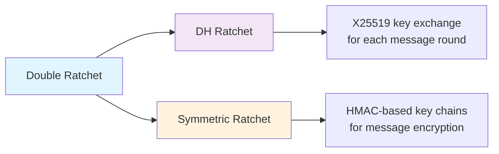

# Double Ratchet (TypeScript)

# This is a failed project: was meant to implement the Triple Ratchet with the scalar multiplication to prevent a two-compromise attack - but we post for the record to show we worked on something.

> **Signal Protocol Implementation with Modern Cryptography**

[](https://choosealicense.com/licenses/mit/)
[](https://www.typescriptlang.org/)
[](https://github.com)
[](https://tools.ietf.org/html/rfc7748)

**Double Ratchet** is an implementation of the [Signal Double Ratchet Protocol](https://signal.org/docs/specifications/doubleratchet/) with **modern cryptographic primitives** following the official specification.

Authors:

Trevor Perrin & Moxie Marlinspike (original DoubleRatchet & X3DH white-paper)

[@peculiarventures](https://github.com/PeculiarVentures) for the `2key-ratchet` ([2key-ratchet on npm](https://www.npmjs.com/package/2key-ratchet)) | ([2key-ratchet on Github](https://github.com/PeculiarVentures/2key-ratchet)) library/source code (under MIT license)

**Security Note:**

This implementation follows the standard Signal Double Ratchet specification. Academic research has identified a theoretical two-compromise attack vulnerability in the protocol, which is demonstrated in our CKA Attack demo.

And finally our team, all part of the Cybersecurity program (**Université Libre de Bruxelles ULB**, **UCLouvain**, **Unamur**):

[@suyeonORG](https://github.com/suyeonORG) |
[@ChaosArnhug](https://github.com/ChaosArnhug) |
[@KTBASECURITY](https://github.com/KTBASECURITY) |
[@Draimy](https://github.com/Draimy)

---

## **Key Enhancements Over 2key-ratchet**

<table>
<tr>
<td width="50%">

### **Signal Protocol**

- **Double Ratchet** - Standard Signal protocol implementation
- **Forward Secrecy** - Past messages remain secure after key compromise
- **Post-Compromise Security** - Protocol heals after state compromise

</td>
<td width="50%">

### **Modern Cryptography**

- **X25519 ECDH** - Fast, secure key agreement (vs. P-256)
- **Ed25519 Signatures** - Compact, secure authentication
- **AES-GCM AEAD** - Authenticated encryption (vs. AES-CBC+HMAC)

</td>
</tr>
<tr>
<td width="50%">

### **Implementation Features**

- **Skipped Message Handling** - Hash map O(1) lookup for out-of-order messages
- **DoS Protection** - Configurable memory bounds and TTL cleanup
- **Signal Spec Compliance** - Follows official Double Ratchet specification

</td>
<td width="50%">

### **Production Ready**

- **Browser Compatible** - **@nobles/curves** integration, low dependency count
- **React/NextJS Demo** - Complete working implementation
- **Real-world Robust** - Handles network issues (out-of-order, gaps, ...)

</td>
</tr>
</table>

---

## **Installation**

(For now, not published on npm)

```bash
git clone https://github.com/suyeonORG/final-triple-ratchet
```

**To install the library**:

```bash
npm i
```

```bash
npm link
```

**To start the demo/use the library**:

```bash
cd /examples/nextjs
```

```bash
npm i
```

Then link the library to the demo code:

```bash
npm link double-ratchet
```

## **Live Demo**

Try the **Double Ratchet** in action with our interactive client-side browser demo:

[https://double-ratchet.suyeon.org](https://double-ratchet.suyeon.org)

Or install it locally:

```bash
git clone https://github.com/suyeonORG/final-triple-ratchet
cd final-triple-ratchet
npm install
npm run build
npm link
```

```bash
cd /examples/nextjs/
npm install
npm link double-ratchet
npm run dev
```

**Demo Features:**

- **Real-time encryption/decryption** with X25519/Ed25519
- **Forward secrecy demonstration** showing key ratcheting
- **Message ordering tests** demonstrating skip-message handling
- **CKA Attack demonstration** showing the theoretical two-compromise vulnerability

---

## **Implementation Features**

| Feature                 | This Implementation     | Benefit                                                  |
| ----------------------- | ----------------------- | -------------------------------------------------------- |
| **Cryptographic Suite** | **X25519/Ed25519**      | Modern, fast elliptic curve cryptography                 |
| **Encryption**          | **AES-GCM**             | Authenticated encryption with associated data (AEAD)     |
| **Hash Function**       | **SHA-512**             | Strong cryptographic hash following Signal specification |
| **Message Ordering**    | **Unlimited gaps**      | Handles any out-of-order message delivery                |
| **Key Lookup**          | **O(1) hash map**       | Efficient skipped message key retrieval                  |
| **DoS Protection**      | **Memory bounds + TTL** | Prevents resource exhaustion attacks                     |
| **Signal Compliance**   | **Full specification**  | Implements official Signal Double Ratchet protocol       |

---

## **What is the Double Ratchet?**

The **Double Ratchet** provides forward secrecy and post-compromise security through two ratcheting mechanisms:



### Security Properties

- **Forward Secrecy**: Compromise of current keys doesn't reveal past messages
- **Post-Compromise Security**: After compromise, new messages become secure again
- **Break-in Recovery**: Protocol heals itself from state compromise
- **Asynchronous Communication**: Works without requiring both parties online

### Vulnerability: Two-Compromise Attack

**Note**: The Double Ratchet has a known theoretical vulnerability where an adversary who compromises a party twice (before and after a DH step) can decrypt messages sent between those compromises. This is a minor limitation that affects security in very specific attack scenarios.

The CKA Attack demo shows this vulnerability in action.

## **Quick Start**

### Basic Usage

```typescript
import {
  Identity,
  AsymmetricRatchet,
  PreKeyBundleProtocol,
  setEngine,
} from "double-ratchet";
import { Crypto } from "@peculiar/webcrypto";
import { Convert } from "pvtsutils";

// Initialize WebCrypto
setEngine("WebCrypto", globalThis.crypto || new Crypto());

// 1. Create identities with X25519/Ed25519
const alice = await Identity.create(1, 1, 1);
const bob = await Identity.create(2, 1, 1);

// 2. Alice creates and shares PreKey bundle
const bundle = new PreKeyBundleProtocol();
bundle.registrationId = alice.id;
await bundle.identity.fill(alice);

const signedPreKey = alice.signedPreKeys[0];
bundle.preKeySigned.id = 0;
bundle.preKeySigned.key = signedPreKey.publicKey;
await bundle.preKeySigned.sign(alice.signingKey.privateKey);

const bundleBytes = await bundle.exportProto();

// 3. Bob imports bundle and creates ratchet
const importedBundle = await PreKeyBundleProtocol.importProto(bundleBytes);
const bobRatchet = await AsymmetricRatchet.create(bob, importedBundle);

// 4. Encrypt message (Bob -> Alice)
const message = "Hello Alice! This is secured with Double Ratchet!";
const encrypted = await bobRatchet.encrypt(Convert.FromUtf8String(message));
const messageBytes = await encrypted.exportProto();

// 5. Alice receives and decrypts
const receivedMessage = await PreKeyMessageProtocol.importProto(messageBytes);
const aliceRatchet = await AsymmetricRatchet.create(alice, receivedMessage);
const decrypted = await aliceRatchet.decrypt(receivedMessage.signedMessage);

console.log(Convert.ToUtf8String(decrypted)); // "Hello Alice! This is secured with Double Ratchet!"
```

### Advanced: Out-of-Order Messages

```typescript
// Double Ratchet handles ANY message order seamlessly
const messages = [];

// Alice sends 5 messages
for (let i = 1; i <= 5; i++) {
  const msg = await aliceRatchet.encrypt(
    Convert.FromUtf8String(`Message ${i}`)
  );
  messages.push(await msg.exportProto());
}

// Bob receives messages in random order: [1, 4, 2, 5, 3]
const order = [0, 3, 1, 4, 2]; // Indices for messages 1, 4, 2, 5, 3

for (const index of order) {
  const proto = await MessageSignedProtocol.importProto(messages[index]);
  const decrypted = await bobRatchet.decrypt(proto);
  console.log(Convert.ToUtf8String(decrypted)); // All decrypt successfully!
}

// Check skipped message statistics
console.log(bobRatchet.getSkippedMessageStats());
// { totalSkippedKeys: 3, ratchetSteps: 1, ratchetKeyIds: 1 }
```

## **Acknowledgments**

### Contributors

- **Signal Foundation** - Double Ratchet protocol specification
- **Petit Christophe (ULB) | Lerman Liran (ULB)** - Academic supervision
- **@peculiarventures** - Initial 2key-ratchet library foundation

### Original Implementation

- **[2key-ratchet](https://github.com/PeculiarVentures/2key-ratchet)** by Peculiar Ventures
- **Trevor Perrin & Moxie Marlinspike** - Signal protocol design
- **Signal Foundation** - Protocol specifications

### Cryptographic Libraries

- **[@noble/curves](https://github.com/paulmillr/noble-curves)** - Modern curve implementations

---

## **License**

This project is licensed under the **MIT License** - see the [LICENSE](LICENSE) file for details.

### Security Disclaimer

> This implementation follows the Signal Double Ratchet specification and uses established cryptographic primitives. However, it has not undergone independent security audit. The implementation includes the known theoretical vulnerability to two-compromise attacks. Use in production environments should be preceded by appropriate security review.
